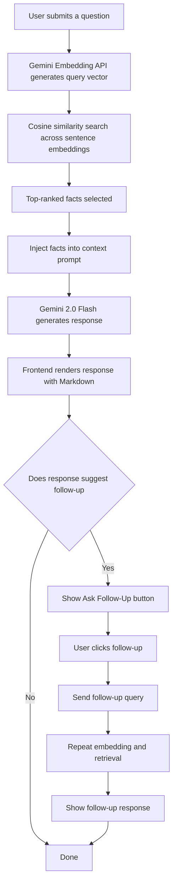

# 🧠 Agentic RAG Demo App

This is a full-stack example of an **Agentic Retrieval-Augmented Generation (RAG)** system built using:

- **Frontend:** React 19 + React Bootstrap (Vite)
- **Backend:** Express.js (Node.js)
- **LLM:** Google Gemini 2.0 Flash
- **Embeddings:** Gemini `embedding-001`
- **Semantic Retrieval:** Cosine similarity
- **RAG Type:** Agentic (multi-step reasoning + follow-up)
- **User Experience:** Chat-style, multi-turn UI with Markdown support

---

## 🚀 Features

- ✅ Ask natural language questions
- ✅ Perform semantic search using embeddings
- ✅ Augment LLM queries with retrieved facts
- ✅ Generate grounded, accurate responses
- ✅ Detect need for follow-up explanations
- ✅ Let the user trigger follow-up generation
- ✅ View multi-turn chat history with scroll-to-bottom
- ✅ Responses rendered in Markdown

---

## 🛠️ Getting Started

### 1. Clone the repo

```bash
git clone https://github.com/your-org/simple-agentic-rag.git
cd simple-agentic-rag
```

### 2. Backend Setup (Express.js)

```bash
cd agentic-rag-server
npm install
cp .env.example .env  # Create your .env and add Gemini API key

node agenticRag.js
```

### 3. Frontend Setup (React)

```bash
cd ../agentic-rag-ui
npm install
npm run dev
```

Frontend runs on `http://localhost:5173`  
Backend runs on `http://localhost:5000`

---

## 📷 Screenshot


---

## 📁 Folder Structure

```
/agentic-rag-ui     → React Vite frontend
/agentic-rag-server → Express.js backend
/data/info.txt      → Grounding source (retrieved facts)
```

---

## 📘 Tech Stack

| Layer      | Tool                          |
|------------|-------------------------------|
| UI         | React 19, React Bootstrap     |
| LLM        | Gemini 2.0 Flash              |
| Embedding  | Gemini `embedding-001`        |
| Retrieval  | Cosine Similarity             |
| Backend    | Node.js + Express.js          |
| Deployment | Vite (frontend), Node.js (server) |

---

## ✅ RAG Workflow

### 🧠 Agentic RAG Workflow (Used in this App)


